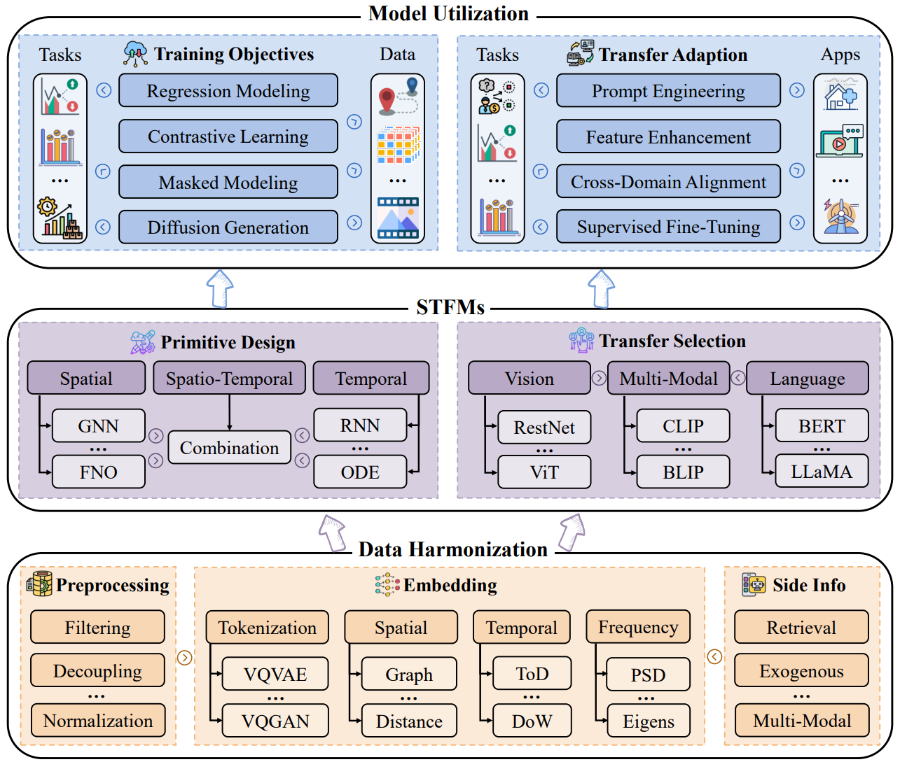

# Awesome Spatio-Temporal Foundation Models

[](https://awesome.re) 
 


Unraveling **Spatio-Temporal Foundation Models** via the **Pipeline** lens  with awesome resources (paper, code, survey, etc.), which aims to comprehensively and systematically summarize the recent advances to the best of our knowledge.

🙋 We will continue to update this repo with the newest resources. If you find any missed resources (paper/code) or errors, please feel free to open an issue or make a pull request.

## Unraveling Spatio-Temporal Foundation Models via the Pipeline Lens: A Comprehensive Review


**Authors**: Yuchen Fang, Hao Miao, Yuxuan Liang, Liwei Deng, Yue Cui, Ximu Zeng, Yuyang Xia, Yan Zhao∗, Torben Bach Pedersen, Christian S. Jensen (*IEEE Fellow*), Xiaofang Zhou (*IEEE Fellow*), and Kai Zheng∗.

||
|:--:| 
| *Figure 1. The pipeline of spatio-temporal foundation models.* |

✨ If you found this survey and repository useful, please consider to star this repository and cite our survey paper:

```bibtex
@article{fang2025unraveling,
      title={Unraveling Spatio-Temporal Foundation Models via the Pipeline Lens: A Comprehensive Review}, 
      author={Yuchen Fang and Hao Miao and Yuxuan Liang and Liwei Deng and Yue Cui and Ximu Zeng and Yuyang Xia and Yan Zhao and Torben Bach Pedersen and Christian S. Jensen and Xiaofang Zhou and and Kai Zheng},
      year={2025},
      archivePrefix={arXiv},
}
```


## Contents

- [Spatio-Temporal Foundation Models](#spatio-temporal-foundation-models)
  - [Contents](#contents)
  - [Data Harmonization](#data-harmonization)
    - [Preprocessing](#preprocessing)
    - [Embedding](#embedding)
    - [Side Information](#side-information)
  - [Primitive Model Construction](#primitive-model-construction)
    - [Spatial](#spatial)
    - [Temporal](#temporal)
    - [Spatio-Temporal](#spatio-temporal)
  - [Transfer Model Construction](#transfer-model-construction)
    - [Vision](#vision)
    - [Language](#language)
    - [Multi-Modal](#multi-modal)
  - [Training Objectives](#training-objectives)
    - [Regression Modeling](#regression-modeling)
    - [Contrastive Learning](#contrastive-learning)
    - [Masked Modeling](#masked-modeling)
    - [Diffusion Generation](#diffusion-generation)
  - [Transfer Adaption](#transfer-adaption)
    - [Prompt Engineering](#prompt-engineering)
    - [Feature Enhancement](#feature-enhancement)
    - [Cross-Domain Alignment](#cross-domain-alignment)
    - [Supervised Fine-Tuning](#supervised-fine-tuning)
  - [Related Spatio-Temporal Foundation Model Resources and Surveys](#related-foundation-model-resources-and-surveys)


## Data Harmonization

### Preprocessing

* Self-supervised Trajectory Representation Learning with Temporal Regularities and Travel Semantics (Traj), in *ICDE* 2023. [[paper](https://arxiv.org/abs/2211.09510)] [[official-code](https://github.com/aptx1231/START)]

* UniTraj: Learning a Universal Trajectory Foundation Model from Billion-Scale Worldwide Traces (Traj), in *arXiv* 2024. [[paper](https://arxiv.org/abs/2411.03859)] [[official-code](https://drive.google.com/drive/folders/1d9pHGvIJtpnmS8qM9D02Bdz40_il-BC4)]

* PTR: A Pre-trained Language Model for Trajectory Recovery (Traj), in *arXiv* 2025. [[paper](https://arxiv.org/abs/2410.14281v1)]

* ClimaX: A foundation model for weather and climate (Grid), in *ICML* 2023. [[paper](https://proceedings.mlr.press/v202/nguyen23a/nguyen23a.pdf)] [[official-code](https://github.com/microsoft/ClimaX)]

* Accurate medium-range global weather forecasting with 3D neural networks (Grid), in *Nature* 2023. [[paper](https://www.nature.com/articles/s41586-023-06185-3)] [[official-code](https://github.com/198808xc/Pangu-Weather)]

* DiffUFlow: Robust Fine-grained Urban Flow Inference with Denoising Diffusion Model (Grid), in *CIKM* 2023. [[paper](https://dl.acm.org/doi/10.1145/3583780.3614842)]

* UniST: A Prompt-Empowered Universal Model for Urban Spatio-Temporal Prediction (Grid), in *KDD* 2024. [[paper](https://dl.acm.org/doi/10.1145/3637528.3671662)] [[official-code](https://github.com/tsinghua-fib-lab/UniST)]

* UrbanDiT: A Foundation Model for Open-World Urban Spatio-Temporal Learning (Grid), in *arXiv* 2024. [[paper](https://arxiv.org/abs/2411.12164)] [[official-code](https://github.com/YuanYuan98/UrbanDiT)]

* VideoLLM: Modeling Video Sequence with Large Language Models (Video), in *arXiv* 2023. [[paper](https://arxiv.org/abs/2305.13292)] [[official-code](https://github.com/cg1177/VideoLLM)]

* VideoChat: Chat-Centric Video Understanding (Video), in *CVPR* 2024. [[paper](https://arxiv.org/abs/2305.06355)] [[official-code](https://github.com/OpenGVLab/Ask-Anything)]

* MovieChat: From Dense Token to Sparse Memory for Long Video Understanding (Video), in *CVPR* 2024. [[paper](https://arxiv.org/abs/2307.16449)] [[official-code](https://github.com/rese1f/MovieChat)]

* Pre-training Enhanced Spatial-temporal Graph Neural Network for Multivariate Time Series Forecasting (Graph), in *KDD* 2022. [[paper](https://dl.acm.org/doi/10.1145/3534678.3539396)] [[official-code](https://github.com/GestaltCogTeam/STEP)]

* Brant: Foundation Model for Intracranial Neural Signal (Graph), in *NeurIPS* 2023. [[paper](https://openreview.net/forum?id=DDkl9vaJyE)] [[official-code](https://zju-brainnet.github.io/Brant.github.io/)]

* Efficient Large-Scale Traffic Forecasting with Transformers: A Spatial Data Management Perspective (Graph), in *KDD* 2025. [[paper](https://arxiv.org/abs/2412.09972)] [[official-code](https://github.com/lmissher/patchstg)]

### Embedding

* TERI: An Effective Framework for Trajectory Recovery with Irregular Time Intervals (Traj), in *VLDB* 2023. [[paper](https://www.vldb.org/pvldb/vol17/p414-chen.pdf)] [[official-code](https://github.com/yileccc/TERI)]

* Pre-Training General Trajectory Embeddings With Maximum Multi-View Entropy Coding (Traj), in *TKDE* 2023. [[paper](https://ieeexplore.ieee.org/document/10375102)] [[official-code](https://github.com/Logan-Lin/MMTEC)]

* KGTS: Contrastive Trajectory Similarity Learning over Prompt Knowledge Graph Embedding (Traj), in *AAAI* 2024. [[paper](https://ojs.aaai.org/index.php/AAAI/article/view/28672)]

* UniTraj: Learning a Universal Trajectory Foundation Model from Billion-Scale Worldwide Traces (Traj), in *arXiv* 2024. [[paper](https://arxiv.org/abs/2411.03859)] [[official-code](https://drive.google.com/drive/folders/1d9pHGvIJtpnmS8qM9D02Bdz40_il-BC4)]

* PTR: A Pre-trained Language Model for Trajectory Recovery (Traj), in *arXiv* 2025. [[paper](https://arxiv.org/abs/2410.14281v1)]

* Learning Dynamic Context Graphs for Predicting Social Events (Event), in *KDD* 2019. [[paper](https://yue-ning.github.io/docs/KDD19-dengA.pdf)] [[official-code](https://github.com/amy-deng/DynamicGCN)]

* Back to the Future: Towards Explainable Temporal Reasoning with Large Language Models (Event), in *WWW* 2024. [[paper](https://dl.acm.org/doi/10.1145/3589334.3645376)] [[official-code](https://github.com/chenhan97/TimeLlama)]

* ClimaX: A foundation model for weather and climate (Grid), in *ICML* 2023. [[paper](https://proceedings.mlr.press/v202/nguyen23a/nguyen23a.pdf)] [[official-code](https://github.com/microsoft/ClimaX)]

* Scale-MAE: A Scale-Aware Masked Autoencoder for Multiscale Geospatial Representation Learning (Grid), in *ICCV* 2023. [[paper](https://openaccess.thecvf.com/content/ICCV2023/papers/Reed_Scale-MAE_A_Scale-Aware_Masked_Autoencoder_for_Multiscale_Geospatial_Representation_Learning_ICCV_2023_paper.pdf)] [[official-code](https://github.com/bair-climate-initiative/scale-mae)]

* Accurate medium-range global weather forecasting with 3D neural networks (Grid), in *Nature* 2023. [[paper](https://www.nature.com/articles/s41586-023-06185-3)] [[official-code](https://github.com/198808xc/Pangu-Weather)]

* UniST: A Prompt-Empowered Universal Model for Urban Spatio-Temporal Prediction (Grid), in *KDD* 2024. [[paper](https://dl.acm.org/doi/10.1145/3637528.3671662)] [[official-code](https://github.com/tsinghua-fib-lab/UniST)]

* WeatherGFM: Learning a Weather Generalist Foundation Model via In-context Learning (Grid), in *ICLR* 2025. [[paper](https://openreview.net/forum?id=izjNI5bcOV)] [[official-code](https://github.com/xiangyu-mm/WeatherGFM)]

* Video-LLaMA: An Instruction-tuned Audio-Visual Language Model for Video Understanding (Video), in *EMNLP* 2023. [[paper](https://arxiv.org/abs/2306.02858)] [[official-code](https://github.com/DAMO-NLP-SG/Video-LLaMA)]

* Retrieving-to-Answer: Zero-Shot Video Question Answering with Frozen Large Language Models (Video), in *ICCV workshop* 2023. [[paper](https://arxiv.org/abs/2306.11732)]

* SEINE: Short-to-Long Video Diffusion Model for Generative Transition and Prediction (Video), in *ICLR* 2024. [[paper](https://openreview.net/forum?id=FNq3nIvP4F)] [[official-code](https://github.com/Vchitect/SEINE)]

* Pre-training Enhanced Spatial-temporal Graph Neural Network for Multivariate Time Series Forecasting (Graph), in *KDD* 2022. [[paper](https://dl.acm.org/doi/10.1145/3534678.3539396)] [[official-code](https://github.com/GestaltCogTeam/STEP)]

* PPi: Pretraining Brain Signal Model for Patient-independent Seizure Detection (Graph), in *NeurIPS* 2023. [[paper](https://papers.nips.cc/paper_files/paper/2023/hash/dbeb7e621d4a554069a6a775da0f7273-Abstract-Conference.html)] [[official-code](https://github.com/yzz673/PPi)]


* Spatial-Temporal-Decoupled Masked Pre-training for Spatiotemporal Forecasting (Graph), in *IJCAI* 2024. [[paper](https://www.ijcai.org/proceedings/2024/0442.pdf)] [[official-code](https://github.com/Jimmy-7664/STD-MAE)]

* OpenCity: Open Spatio-Temporal Foundation Models for Traffic Prediction (Graph), in *arXiv* 2024. [[paper](https://arxiv.org/abs/2408.10269)] [[official-code](https://github.com/HKUDS/OpenCity)]

* G2PTL: A Geography-Graph Pre-trained Model (Graph), in *CIKM* 2024. [[paper](https://dl.acm.org/doi/10.1145/3627673.3680023)]

### Side Information

* PTrajM: Efficient and Semantic-rich Trajectory Learning with Pretrained Trajectory-Mamba (Traj), in *arXiv* 2024. [[paper](https://arxiv.org/abs/2408.04916)]

* ControlTraj: Controllable Trajectory Generation with Topology-Constrained Diffusion Model (Traj), in *KDD* 2024. [[paper](https://dl.acm.org/doi/10.1145/3637528.3671866)] [[official-code](https://github.com/Yasoz/ControlTraj)]

* PTR: A Pre-trained Language Model for Trajectory Recovery (Traj), in *arXiv* 2025. [[paper](https://arxiv.org/abs/2410.14281v1)]

* Robust Event Forecasting with Spatiotemporal Confounder Learning (Event), in *KDD* 2022. [[paper](https://dl.acm.org/doi/10.1145/3534678.3539427)]

* ONSEP: A Novel Online Neural-Symbolic Framework for Event Prediction Based on Large Language Model (Event), in *ACL* 2024. [[paper](https://arxiv.org/abs/2408.07840)] [[official-code](https://github.com/aqSeabiscuit/ONSEP)]

* Back to the Future: Towards Explainable Temporal Reasoning with Large Language Models (Event), in *WWW* 2024. [[paper](https://dl.acm.org/doi/10.1145/3589334.3645376)] [[official-code](https://github.com/chenhan97/TimeLlama)]

* DiffUFlow: Robust Fine-grained Urban Flow Inference with Denoising Diffusion Model (Grid), in *CIKM* 2023. [[paper](https://dl.acm.org/doi/10.1145/3583780.3614842)]

* UrbanGPT: Spatio-Temporal Large Language Models (Grid), in *KDD* 2024. [[paper](https://dl.acm.org/doi/10.1145/3637528.3671578)] [[official-code](https://github.com/HKUDS/UrbanGPT)]

* Zero-Shot Video Question Answering via Frozen Bidirectional Language Models (Video), in *NeurIPS* 2022. [[paper](https://arxiv.org/abs/2206.08155)] [[official-code](https://github.com/antoyang/FrozenBiLM)]

* Video-LLaMA: An Instruction-tuned Audio-Visual Language Model for Video Understanding (Video), in *EMNLP* 2023. [[paper](https://arxiv.org/abs/2306.02858)] [[official-code](https://github.com/DAMO-NLP-SG/Video-LLaMA)]

* GenAD: Generalized Predictive Model for Autonomous Driving (Video), in *CVPR* 2024. [[paper](https://arxiv.org/abs/2403.09630)] [[official-code](https://github.com/OpenDriveLab/DriveAGI)]

* PowerPM: Foundation Model for Power Systems (Graph), in *NeurIPS* 2024. [[paper](https://proceedings.neurips.cc/paper_files/paper/2024/hash/d0a2279c9f7ded859bcbf878c3c3d1ed-Abstract-Conference.html)]

* Efficient Large-Scale Traffic Forecasting with Transformers: A Spatial Data Management Perspective (Graph), in *KDD* 2025. [[paper](https://arxiv.org/abs/2412.09972)] [[official-code](https://github.com/lmissher/patchstg)]

### Datasets

Please refer to the Table II in the paper.

## Primitive Model Design

### Spatial

* ClimaX: A foundation model for weather and climate, in *ICML* 2023. [[paper](https://proceedings.mlr.press/v202/nguyen23a/nguyen23a.pdf)] [[official-code](https://github.com/microsoft/ClimaX)]

* Automated Spatio-Temporal Graph Contrastive Learning, in *WWW* 2023. [[paper](https://dl.acm.org/doi/10.1145/3543507.3583304)] [[official-code](https://github.com/HKUDS/AutoST)]

* Spatial Structure-Aware Road Network Embedding via Graph Contrastive Learning, in *EDBT* 2023. [[paper](https://openproceedings.org/2023/conf/edbt/paper-193.pdf)] [[official-code](https://github.com/changyanchuan/SARN)]

* Spatial-Temporal Graph Learning with Adversarial Contrastive Adaptation, in *ICML* 2023. [[paper](https://proceedings.mlr.press/v202/zhang23p.html)] [[official-code](https://github.com/HKUDS/GraphST)]

* Scale-MAE: A Scale-Aware Masked Autoencoder for Multiscale Geospatial Representation Learning, in *ICCV* 2023. [[paper](https://openaccess.thecvf.com/content/ICCV2023/papers/Reed_Scale-MAE_A_Scale-Aware_Masked_Autoencoder_for_Multiscale_Geospatial_Representation_Learning_ICCV_2023_paper.pdf)] [[official-code](https://github.com/bair-climate-initiative/scale-mae)]

* Accurate medium-range global weather forecasting with 3D neural networks, in *Nature* 2023. [[paper](https://www.nature.com/articles/s41586-023-06185-3)] [[official-code](https://github.com/198808xc/Pangu-Weather)]

* FourCastNet: Accelerating Global High-Resolution Weather Forecasting Using Adaptive Fourier Neural Operators, in *PASC* 2023. [[paper](https://dl.acm.org/doi/10.1145/3592979.3593412)] [[official-code](https://github.com/NVlabs/FourCastNet)]

* FengWu: Pushing the Skillful Global Medium-range Weather Forecast beyond 10 Days Lead, in *arXiv* 2023. [[paper](https://arxiv.org/abs/2304.02948)] [[official-code](https://github.com/OpenEarthLab/FengWu)]

* Diffusion Probabilistic Modeling for Fine-Grained Urban Traffic Flow Inference with Relaxed Structural Constraint, in *ICASSP* 2023. [[paper](https://ieeexplore.ieee.org/document/10096169)]

* DiffUFlow: Robust Fine-grained Urban Flow Inference with Denoising Diffusion Model, in *CIKM* 2023. [[paper](https://dl.acm.org/doi/10.1145/3583780.3614842)]

* DiffCrime: A Multimodal Conditional Diffusion Model for Crime Risk Map Inference, in *KDD* 2024. [[paper](https://dl.acm.org/doi/10.1145/3637528.3671843)] [[official-code](https://github.com/IvoPan93/DiffCrime)]

* G2PTL: A Geography-Graph Pre-trained Model, in *CIKM* 2024. [[paper](https://dl.acm.org/doi/10.1145/3627673.3680023)]

* UniST: A Prompt-Empowered Universal Model for Urban Spatio-Temporal Prediction, in *KDD* 2024. [[paper](https://dl.acm.org/doi/10.1145/3637528.3671662)] [[official-code](https://github.com/tsinghua-fib-lab/UniST)]

* Earthfarseer: Versatile Spatio-Temporal Dynamical Systems Modeling in One Model, in *AAAI* 2024. [[paper](https://arxiv.org/pdf/2312.08403)] [[official-code](https://github.com/easylearningscores/EarthFarseer)]

* Causal Deciphering and Inpainting in Spatio-Temporal Dynamics via Diffusion Model, in *NeurIPS* 2024. [[paper](https://arxiv.org/abs/2409.19608)]

* WeatherGFM: Learning a Weather Generalist Foundation Model via In-context Learning, in *ICLR* 2025. [[paper](https://openreview.net/forum?id=izjNI5bcOV)] [[official-code](https://github.com/xiangyu-mm/WeatherGFM)]

* PhyDA: Physics-Guided Diffusion Models for Data Assimilation in Atmospheric Systems, in *arXiv* 2025. [[paper](https://arxiv.org/abs/2505.12882)]

### Temporal

* Efficient Trajectory Similarity Computation with Contrastive Learning, in *CIKM* 2022. [[paper](https://zheng-kai.com/paper/cikm_2022_deng.pdf)] [[official-code](https://github.com/LIWEIDENG0830/CL-TSim)]

* Pre-training Enhanced Spatial-temporal Graph Neural Network for Multivariate Time Series Forecasting, in *KDD* 2022. [[paper](https://dl.acm.org/doi/10.1145/3534678.3539396)] [[official-code](https://github.com/GestaltCogTeam/STEP)]

* Pre-Training General Trajectory Embeddings With Maximum Multi-View Entropy Coding, in *TKDE* 2023. [[paper](https://ieeexplore.ieee.org/document/10375102)] [[official-code](https://github.com/Logan-Lin/MMTEC)]

* Contrastive Trajectory Similarity Learning with Dual-Feature Attention, in *ICDE* 2023. [[paper](https://arxiv.org/abs/2210.05155)] [[official-code](https://github.com/changyanchuan/TrajCL)]

* PPi: Pretraining Brain Signal Model for Patient-independent Seizure Detection, in *NeurIPS* 2023. [[paper](https://papers.nips.cc/paper_files/paper/2023/hash/dbeb7e621d4a554069a6a775da0f7273-Abstract-Conference.html)] [[official-code](https://github.com/yzz673/PPi)]

* TrajFM: A Vehicle Trajectory Foundation Model for Region and Task Transferability, in *arXiv* 2024. [[paper](https://arxiv.org/abs/2408.15251)] [[official-code](https://anonymous.4open.science/r/TrajFM-30E4/readme.md)]

* ControlTraj: Controllable Trajectory Generation with Topology-Constrained Diffusion Model, in *KDD* 2024. [[paper](https://dl.acm.org/doi/10.1145/3637528.3671866)] [[official-code](https://github.com/Yasoz/ControlTraj)]

* EEGPT: Unleashing the Potential of EEG Generalist Foundation Model by Autoregressive Pre-training, in *arXiv* 2024. [[paper](https://arxiv.org/abs/2410.19779)]

* Frequency-aware Generative Models for Multivariate Time Series Imputation, in *NeurIPS* 2024. [[paper](https://openreview.net/forum?id=UE6CeRMnq3&noteId=7LmUCl1XoB)] [[official-code](https://github.com/FGTI2024/FGTI24)]

* Large Brain Model for Learning Generic Representations with Tremendous EEG Data in BCI, in *ICLR* 2024. [[paper](https://arxiv.org/abs/2405.18765)] [[official-code](https://github.com/935963004/LaBraM)]

* UniTraj: Learning a Universal Trajectory Foundation Model from Billion-Scale Worldwide Traces, in *arXiv* 2024. [[paper](https://arxiv.org/abs/2411.03859)] [[official-code](https://drive.google.com/drive/folders/1d9pHGvIJtpnmS8qM9D02Bdz40_il-BC4)]

* More Than Routing: Joint GPS and Route Modeling for Refine Trajectory Representation Learning, in *WWW* 2024. [[paper](https://dl.acm.org/doi/10.1145/3589334.3645644)] [[official-code](https://github.com/mamazi0131/JGRM)]

* MTSCI: A Conditional Diffusion Model for Multivariate Time Series Consistent Imputation, in *CIKM* 2024. [[paper](https://dl.acm.org/doi/10.1145/3627673.3679532)] [[official-code](https://github.com/JeremyChou28/MTSCI)]

* Score-CDM: Score-Weighted Convolutional Diffusion Model for Multivariate Time Series Imputation, in *IJCAI* 2024. [[paper](https://www.ijcai.org/proceedings/2024/0282.pdf)]

* Spatial-Temporal-Decoupled Masked Pre-training for Spatiotemporal Forecasting, in *IJCAI* 2024. [[paper](https://www.ijcai.org/proceedings/2024/0442.pdf)] [[official-code](https://github.com/Jimmy-7664/STD-MAE)]

* Tiny Time Mixers (TTMs): Fast Pre-trained Models for Enhanced Zero/Few-Shot Forecasting of Multivariate Time Series, in *NeurIPS* 2024. [[paper](https://arxiv.org/abs/2401.03955)] [[official-code](https://github.com/ibm-granite/granite-tsfm/tree/main/tsfm_public/models/tinytimemixer)]

### Spatio-Temporal

* Robust Event Forecasting with Spatiotemporal Confounder Learning, in *KDD* 2022. [[paper](https://dl.acm.org/doi/10.1145/3534678.3539427)]

* When Do Contrastive Learning Signals Help Spatio-Temporal Graph Forecasting?, in *SIGSPATIAL* 2022. [[paper](https://dl.acm.org/doi/10.1145/3557915.3560939)] [[official-code](https://github.com/liuxu77/STGCL)]

* Unified Route Representation Learning for Multi-Modal Transportation Recommendation with Spatiotemporal Pre-Training, in *VLDBJ* 2022. [[paper](https://link.springer.com/article/10.1007/s00778-022-00748-y)]

* Jointly Contrastive Representation Learning on Road Network and Trajectory, in *CIKM* 2022. [[paper](https://dl.acm.org/doi/abs/10.1145/3511808.3557370)] [[official-code](https://github.com/mzy94/JCLRNT)]

* Spatial-Temporal Hypergraph Self-Supervised Learning for Crime Prediction, in *ICDE* 2022. [[paper](https://arxiv.org/abs/2204.08587)] [[official-code](https://github.com/LZH-YS1998/STHSL)]

* DiffSTG: Probabilistic Spatio-Temporal Graph Forecasting with Denoising Diffusion Models, in *SIGSPATIAL* 2023. [[paper](https://dl.acm.org/doi/10.1145/3589132.3625614)] [[official-code](https://github.com/wenhaomin/DiffSTG)]

* PriSTI: A Conditional Diffusion Framework for Spatiotemporal Imputation, in *ICDE* 2023. [[paper](https://arxiv.org/abs/2302.09746)] [[official-code](https://github.com/LMZZML/PriSTI)]

* Spatio-Temporal Denoising Graph Autoencoders with Data Augmentation for Photovoltaic Data Imputation, in *SIGMOD* 2023. [[paper](https://dl.acm.org/doi/abs/10.1145/3588730)] [[official-code](https://github.com/Yangxin666/STGAE)]

* Brant: Foundation Model for Intracranial Neural Signal, in *NeurIPS* 2023. [[paper](https://openreview.net/forum?id=DDkl9vaJyE)] [[official-code](https://zju-brainnet.github.io/Brant.github.io/)]

* Self-supervised Trajectory Representation Learning with Temporal Regularities and Travel Semantics, in *ICDE* 2023. [[paper](https://arxiv.org/abs/2211.09510)] [[official-code](https://github.com/aptx1231/START)]

* Spatio-Temporal Meta Contrastive Learning, in *CIKM* 2023. [[paper](https://arxiv.org/abs/2310.17678)] [[official-code](https://github.com/HKUDS/CL4ST)]

* Spatio-Temporal Self-Supervised Learning for Traffic Flow Prediction, in *AAAI* 2023. [[paper](https://arxiv.org/abs/2212.04475)] [[official-code](https://github.com/Echo-Ji/ST-SSL)]

* Spatio-temporal Diffusion Point Processes, in *KDD* 2023. [[paper](https://dl.acm.org/doi/10.1145/3580305.3599511)] [[official-code](https://github.com/tsinghua-fib-lab/Spatio-temporal-Diffusion-Point-Processes)]

* A Spatio-Temporal Diffusion Model for Missing and Real-Time Financial Data Inference, in *CIKM* 2024. [[paper](https://arxiv.org/abs/2408.15251)]

* DiffLight: A Partial Rewards Conditioned Diffusion Model for Traffic Signal Control with Missing Data, in *NeurIPS* 2024. [[paper](https://openreview.net/forum?id=A969ouPqEs&noteId=hqLbQNpbT4)] [[official-code](https://github.com/lokol5579/DiffLight-release)]

* Diffstock: Probabilistic Relational Stock Market Predictions Using Diffusion Models, in *ICASSP* 2024. [[paper](https://ieeexplore.ieee.org/document/10446690)]

* KGTS: Contrastive Trajectory Similarity Learning over Prompt Knowledge Graph Embedding, in *AAAI* 2024. [[paper](https://ojs.aaai.org/index.php/AAAI/article/view/28672)]

* MSTEM: Masked Spatiotemporal Event Series Modeling for Urban Undisciplined Events Forecasting, in *CIKM* 2024. [[paper](https://dl.acm.org/doi/10.1145/3627673.3679810)]

* Multi-Modality Spatio-Temporal Forecasting via Self-Supervised Learning, in *IJCAI* 2024. [[paper](https://www.ijcai.org/proceedings/2024/0223.pdf)] [[official-code](https://github.com/beginner-sketch/MoSSL)]

* Towards Unifying Diffusion Models for Probabilistic Spatio-Temporal Graph Learning, in *SIGSPATIAL* 2024. [[paper](https://arxiv.org/pdf/2310.17360)] [[official-code](https://github.com/hjf1997/USTD)]

* UrbanGPT: Spatio-Temporal Large Language Models, in *KDD* 2024. [[paper](https://dl.acm.org/doi/10.1145/3637528.3671578)] [[official-code](https://github.com/HKUDS/UrbanGPT)]

* UrbanDiT: A Foundation Model for Open-World Urban Spatio-Temporal Learning, in *arXiv* 2024. [[paper](https://arxiv.org/abs/2411.12164)] [[official-code](https://github.com/YuanYuan98/UrbanDiT)]

* OpenCity: Open Spatio-Temporal Foundation Models for Traffic Prediction, in *arXiv* 2024. [[paper](https://arxiv.org/abs/2408.10269)] [[official-code](https://github.com/HKUDS/OpenCity)]

* Social Physics Informed Diffusion Model for Crowd Simulation, in *AAAI* 2024. [[paper](https://arxiv.org/abs/2402.06680)] [[official-code](https://github.com/tsinghua-fib-lab/SPDiff)]

* PowerPM: Foundation Model for Power Systems, in *NeurIPS* 2024. [[paper](https://proceedings.neurips.cc/paper_files/paper/2024/hash/d0a2279c9f7ded859bcbf878c3c3d1ed-Abstract-Conference.html)]

* FusionSF: Fuse Heterogeneous Modalities in a Vector Quantized Framework for Robust Solar Power Forecasting, in *KDD* 2024. [[paper](https://arxiv.org/abs/2402.05823)] [[official-code](https://github.com/MAZiqing/FusionSF)]

* SaSDim:Self-adaptive Noise Scaling Diffusion Model for Spatial Time Series Imputation, in *IJCAI* 2024. [[paper](https://www.ijcai.org/proceedings/2024/283)]

## Training Objectives

### Regression Modeling

* ClimaX: A foundation model for weather and climate, in *ICML* 2023. [[paper](https://proceedings.mlr.press/v202/nguyen23a/nguyen23a.pdf)] [[official-code](https://github.com/microsoft/ClimaX)]

* PointGPT: Auto-regressively Generative Pre-training from Point Clouds, in *NeurIPS* 2023. [[paper](https://arxiv.org/abs/2305.11487)] [[official-code](https://github.com/CGuangyan-BIT/PointGPT)]

* FourCastNet: Accelerating Global High-Resolution Weather Forecasting Using Adaptive Fourier Neural Operators, in *PASC* 2023. [[paper](https://dl.acm.org/doi/10.1145/3592979.3593412)] [[official-code](https://github.com/NVlabs/FourCastNet)]

* FengWu: Pushing the Skillful Global Medium-range Weather Forecast beyond 10 Days Lead, in *arXiv* 2023. [[paper](https://arxiv.org/abs/2304.02948)] [[official-code](https://github.com/OpenEarthLab/FengWu)]

* TrajFM: A Vehicle Trajectory Foundation Model for Region and Task Transferability, in *arXiv* 2024. [[paper](https://arxiv.org/abs/2408.15251)] [[official-code](https://anonymous.4open.science/r/TrajFM-30E4/readme.md)]

* OpenCity: Open Spatio-Temporal Foundation Models for Traffic Prediction, in *arXiv* 2024. [[paper](https://arxiv.org/abs/2408.10269)] [[official-code](https://github.com/HKUDS/OpenCity)]

* Large Brain Model for Learning Generic Representations with Tremendous EEG Data in BCI, in *ICLR* 2024. [[paper](https://arxiv.org/abs/2405.18765)] [[official-code](https://github.com/935963004/LaBraM)]

* EEGPT: Unleashing the Potential of EEG Generalist Foundation Model by Autoregressive Pre-training, in *arXiv* 2024. [[paper](https://arxiv.org/abs/2410.19779)]

* iVideoGPT: Interactive VideoGPTs are Scalable World Models, in *NeurIPS* 2024. [[paper](https://arxiv.org/abs/2405.15223)] [[official-code](https://thuml.github.io/iVideoGPT/)]

* Everything is a Video: Unifying Modalities through Next-Frame Prediction, in *arXiv* 2024. [[paper](https://arxiv.org/abs/2411.10503)]

* Visual Autoregressive Modeling: Scalable Image Generation via Next-Scale Prediction, in *NeurIPS* 2024. [[paper](https://arxiv.org/abs/2404.02905)] [[official-code](https://github.com/FoundationVision/VAR)]

* UVTM: Universal Vehicle Trajectory Modeling with ST Feature Domain Generation, in *TKDE* 2025. [[paper](https://arxiv.org/abs/2402.07232)] [[official-code](https://github.com/Logan-Lin/UVTM)]

### Masked Modeling

* Masked Autoencoders for Point Cloud Self-supervised Learning, in *ECCV* 2022. [[paper](https://arxiv.org/abs/2203.06604)] [[official-code](https://github.com/Pang-Yatian/Point-MAE)]

* Masked Autoencoders As Spatiotemporal Learners, in *NeurIPS* 2022. [[paper](https://arxiv.org/abs/2205.09113)] [[official-code](https://github.com/facebookresearch/mae_st)]

* VideoMAE: Masked Autoencoders are Data-Efficient Learners for Self-Supervised Video Pre-Training, in *NeurIPS* 2022. [[paper](https://arxiv.org/abs/2203.12602)] [[official-code](https://github.com/MCG-NJU/VideoMAE)]

* Pre-training Enhanced Spatial-temporal Graph Neural Network for Multivariate Time Series Forecasting, in *KDD* 2022. [[paper](https://arxiv.org/abs/2206.09113)] [[official-code](https://github.com/GestaltCogTeam/STEP)]

* MARLIN: Masked Autoencoder for Facial Video Representation Learning, in *CVPR* 2023. [[paper](https://arxiv.org/abs/2211.06627)] [[official-code](https://github.com/ControlNet/MARLIN)]

* GPT-ST: Generative Pre-Training of Spatio-Temporal Graph Neural Networks, in *NeurIPS* 2023. [[paper](https://arxiv.org/abs/2311.04245)] [[official-code](https://github.com/HKUDS/GPT-ST)]

* Brant: Foundation Model for Intracranial Neural Signal, in *NeurIPS* 2023. [[paper](https://openreview.net/forum?id=DDkl9vaJyE)] [[official-code](https://zju-brainnet.github.io/Brant.github.io/)]

* Scale-MAE: A Scale-Aware Masked Autoencoder for Multiscale Geospatial Representation Learning, in *ICCV* 2023. [[paper](https://openaccess.thecvf.com/content/ICCV2023/papers/Reed_Scale-MAE_A_Scale-Aware_Masked_Autoencoder_for_Multiscale_Geospatial_Representation_Learning_ICCV_2023_paper.pdf)] [[official-code](https://github.com/bair-climate-initiative/scale-mae)]

* PowerPM: Foundation Model for Power Systems, in *NeurIPS* 2024. [[paper](https://proceedings.neurips.cc/paper_files/paper/2024/hash/d0a2279c9f7ded859bcbf878c3c3d1ed-Abstract-Conference.html)]

* UniTraj: Learning a Universal Trajectory Foundation Model from Billion-Scale Worldwide Traces, in *arXiv* 2024. [[paper](https://arxiv.org/abs/2411.03859)] [[official-code](https://drive.google.com/drive/folders/1d9pHGvIJtpnmS8qM9D02Bdz40_il-BC4)]

* G2PTL: A Geography-Graph Pre-trained Model, in *CIKM* 2024. [[paper](https://dl.acm.org/doi/10.1145/3627673.3680023)]

* Temporal-Frequency Masked Autoencoders for Time Series Anomaly Detection, in *ICDE* 2024. [[paper](https://ieeexplore.ieee.org/document/10597757)] [[official-code](https://github.com/LMissher/TFMAE)]

* UniST: A Prompt-Empowered Universal Model for Urban Spatio-Temporal Prediction, in *KDD* 2024. [[paper](https://dl.acm.org/doi/10.1145/3637528.3671662)] [[official-code](https://github.com/tsinghua-fib-lab/UniST)]

* Spatial-Temporal-Decoupled Masked Pre-training for Spatiotemporal Forecasting, in *IJCAI* 2024. [[paper](https://www.ijcai.org/proceedings/2024/0442.pdf)] [[official-code](https://github.com/Jimmy-7664/STD-MAE)]

* Revealing the Power of Masked Autoencoders in Traffic Forecasting, in *CIKM* 2024. [[paper](https://dl.acm.org/doi/10.1145/3627673.3679989)] [[official-code](https://github.com/jsun57/STMAE)]

* WeatherGFM: Learning a Weather Generalist Foundation Model via In-context Learning, in *ICLR* 2025. [[paper](https://openreview.net/forum?id=izjNI5bcOV)] [[official-code](https://github.com/xiangyu-mm/WeatherGFM)]

### Contrastive Learning

* Efficient Spatio-Temporal Contrastive Learning for Skeleton-Based 3-D Action Recognition, in *TMM* 2021. [[paper](https://ieeexplore.ieee.org/document/9612062)]

* Dual Contrastive Learning for Spatio-temporal Representation, in *ACM MM* 2022. [[paper](https://arxiv.org/abs/2207.05340)]

* Contextualized Spatio-Temporal Contrastive Learning with Self-Supervision, in *CVPR* 2022. [[paper](https://arxiv.org/abs/2112.05181)] [[official-code](https://github.com/tensorflow/models/tree/master/official/projects/const_cl)]

* Efficient Trajectory Similarity Computation with Contrastive Learning, in *CIKM* 2022. [[paper](https://zheng-kai.com/paper/cikm_2022_deng.pdf)] [[official-code](https://github.com/LIWEIDENG0830/CL-TSim)]

* Mining Spatio-temporal Relations via Self-paced Graph Contrastive Learning, in *KDD* 2022. [[paper](https://dl.acm.org/doi/10.1145/3534678.3539422)] [[official-code](https://github.com/RongfanLi98/SPGCL)]

* When Do Contrastive Learning Signals Help Spatio-Temporal Graph Forecasting?, in *SIGSPATIAL* 2022. [[paper](https://dl.acm.org/doi/10.1145/3557915.3560939)] [[official-code](https://github.com/liuxu77/STGCL)]

* Spatial-Temporal Hypergraph Self-Supervised Learning for Crime Prediction, in *ICDE* 2022. [[paper](https://arxiv.org/abs/2204.08587)] [[official-code](https://github.com/LZH-YS1998/STHSL)]

* Pre-Training General Trajectory Embeddings With Maximum Multi-View Entropy Coding, in *TKDE* 2023. [[paper](https://arxiv.org/pdf/2207.14539)] [[official-code](https://github.com/Logan-Lin/MMTEC)]

* Self-supervised Trajectory Representation Learning with Temporal Regularities and Travel Semantics, in *ICDE* 2023. [[paper](https://arxiv.org/abs/2211.09510)] [[official-code](https://github.com/aptx1231/START)]

* Automated Spatio-Temporal Graph Contrastive Learning, in *WWW* 2023. [[paper](https://dl.acm.org/doi/10.1145/3543507.3583304)] [[official-code](https://github.com/HKUDS/AutoST)]

* Contrastive Trajectory Similarity Learning with Dual-Feature Attention, in *ICDE* 2023. [[paper](https://arxiv.org/abs/2210.05155)] [[official-code](https://github.com/changyanchuan/TrajCL)]

* Spatio-Temporal Self-Supervised Learning for Traffic Flow Prediction, in *AAAI* 2023. [[paper](https://arxiv.org/abs/2212.04475)] [[official-code](https://github.com/Echo-Ji/ST-SSL)]

* STWave+: A Multi-Scale Efficient Spectral Graph Attention Network With Long-Term Trends for Disentangled Traffic Flow Forecasting, in *TKDE* 2023. [[paper](https://ieeexplore.ieee.org/document/10286992)] [[official-code](https://github.com/LMissher/STWave)]

* Spatio-Temporal Meta Contrastive Learning, in *CIKM* 2023. [[paper](https://arxiv.org/abs/2310.17678)] [[official-code](https://github.com/HKUDS/CL4ST)]

* UrbanCLIP: Learning Text-enhanced Urban Region Profiling with Contrastive Language-Image Pretraining from the Web, in *WWW* 2024. [[paper](https://arxiv.org/abs/2310.18340)] [[official-code](https://github.com/StupidBuluchacha/UrbanCLIP)]

* PTrajM: Efficient and Semantic-rich Trajectory Learning with Pretrained Trajectory-Mamba, in *arXiv* 2024. [[paper](https://arxiv.org/abs/2408.04916)]

* More Than Routing: Joint GPS and Route Modeling for Refine Trajectory Representation Learning, in *WWW* 2024. [[paper](https://dl.acm.org/doi/10.1145/3589334.3645644)] [[official-code](https://github.com/mamazi0131/JGRM)]

* FlashST: A Simple and Universal Prompt-Tuning Framework for Traffic Prediction, in *ICML* 2024. [[paper](https://arxiv.org/abs/2405.17898)] [[official-code](https://github.com/HKUDS/FlashST)]

### Diffusion Generation

* Diffusion Probabilistic Modeling for Fine-Grained Urban Traffic Flow Inference with Relaxed Structural Constraint, in *ICASSP* 2023. [[paper](https://ieeexplore.ieee.org/document/10096169)]

* DYffusion: A Dynamics-informed Diffusion Model for Spatiotemporal Forecasting, in *NeurIPS* 2023. [[paper](https://arxiv.org/abs/2306.01984)] [[official-code](https://github.com/Rose-STL-Lab/dyffusion)]

* DiffSTG: Probabilistic Spatio-Temporal Graph Forecasting with Denoising Diffusion Models, in *SIGSPATIAL* 2023. [[paper](https://dl.acm.org/doi/10.1145/3589132.3625614)] [[official-code](https://github.com/wenhaomin/DiffSTG)]

* DiffTraj: Generating GPS Trajectory with Diffusion Probabilistic Model, in *NeurIPS* 2023. [[paper](https://arxiv.org/abs/2304.11582)] [[official-code](https://github.com/Yasoz/DiffTraj)]

* PriSTI: A Conditional Diffusion Framework for Spatiotemporal Imputation, in *ICDE* 2023. [[paper](https://arxiv.org/abs/2302.09746)] [[official-code](https://github.com/LMZZML/PriSTI)]

* DiffUFlow: Robust Fine-grained Urban Flow Inference with Denoising Diffusion Model, in *CIKM* 2023. [[paper](https://dl.acm.org/doi/10.1145/3583780.3614842)]

* Spatio-temporal Diffusion Point Processes, in *KDD* 2023. [[paper](https://dl.acm.org/doi/10.1145/3580305.3599511)] [[official-code](https://github.com/tsinghua-fib-lab/Spatio-temporal-Diffusion-Point-Processes)]

* DiffCrime: A Multimodal Conditional Diffusion Model for Crime Risk Map Inference, in *KDD* 2024. [[paper](https://dl.acm.org/doi/10.1145/3637528.3671843)] [[official-code](https://github.com/IvoPan93/DiffCrime)]

* Social Physics Informed Diffusion Model for Crowd Simulation, in *AAAI* 2024. [[paper](https://arxiv.org/abs/2402.06680)] [[official-code](https://github.com/tsinghua-fib-lab/SPDiff)]

* Causal Deciphering and Inpainting in Spatio-Temporal Dynamics via Diffusion Model, in *NeurIPS* 2024. [[paper](https://arxiv.org/abs/2409.19608)]

* Towards Unifying Diffusion Models for Probabilistic Spatio-Temporal Graph Learning, in *SIGSPATIAL* 2024. [[paper](https://arxiv.org/pdf/2310.17360)] [[official-code](https://github.com/hjf1997/USTD)]

* Frequency-aware Generative Models for Multivariate Time Series Imputation, in *NeurIPS* 2024. [[paper](https://openreview.net/forum?id=UE6CeRMnq3&noteId=7LmUCl1XoB)] [[official-code](https://github.com/FGTI2024/FGTI24)]

* ControlTraj: Controllable Trajectory Generation with Topology-Constrained Diffusion Model, in *KDD* 2024. [[paper](https://dl.acm.org/doi/10.1145/3637528.3671866)] [[official-code](https://github.com/Yasoz/ControlTraj)]

* Score-CDM: Score-Weighted Convolutional Diffusion Model for Multivariate Time Series Imputation, in *IJCAI* 2024. [[paper](https://www.ijcai.org/proceedings/2024/0282.pdf)]

* SaSDim:Self-adaptive Noise Scaling Diffusion Model for Spatial Time Series Imputation, in *IJCAI* 2024. [[paper](https://www.ijcai.org/proceedings/2024/283)]

* DiffLight: A Partial Rewards Conditioned Diffusion Model for Traffic Signal Control with Missing Data, in *NeurIPS* 2024. [[paper](https://openreview.net/forum?id=A969ouPqEs&noteId=hqLbQNpbT4)] [[official-code](https://github.com/lokol5579/DiffLight-release)]

* PhyDA: Physics-Guided Diffusion Models for Data Assimilation in Atmospheric Systems, in *arXiv* 2025. [[paper](https://arxiv.org/abs/2505.12882)]


## Transfer Model Selection

### Vision

* Dual Contrastive Learning for Spatio-temporal Representation, in *ACM MM* 2022. [[paper](https://arxiv.org/abs/2207.05340)]

* Masked Autoencoders As Spatiotemporal Learners, in *NeurIPS* 2022. [[paper](https://arxiv.org/abs/2205.09113)] [[official-code](https://github.com/facebookresearch/mae_st)]

* VideoMAE: Masked Autoencoders are Data-Efficient Learners for Self-Supervised Video Pre-Training, in *NeurIPS* 2022. [[paper](https://arxiv.org/abs/2203.12602)] [[official-code](https://github.com/MCG-NJU/VideoMAE)]

* SEINE: Short-to-Long Video Diffusion Model for Generative Transition and Prediction, in *ICLR* 2024. [[paper](https://openreview.net/forum?id=FNq3nIvP4F)] [[official-code](https://github.com/Vchitect/SEINE)]

* LLMs are Good Action Recognizers, in *CVPR* 2024. [[paper](https://arxiv.org/abs/2404.00532)]

* iVideoGPT: Interactive VideoGPTs are Scalable World Models, in *NeurIPS* 2024. [[paper](https://arxiv.org/abs/2405.15223)] [[official-code](https://thuml.github.io/iVideoGPT/)]

* GenAD: Generalized Predictive Model for Autonomous Driving, in *CVPR* 2024. [[paper](https://arxiv.org/abs/2403.09630)] [[official-code](https://github.com/OpenDriveLab/DriveAGI)]

* VideoChat: Chat-Centric Video Understanding, in *CVPR* 2024. [[paper](https://arxiv.org/abs/2305.06355)] [[official-code](https://github.com/OpenGVLab/Ask-Anything)]

* MovieChat: From Dense Token to Sparse Memory for Long Video Understanding, in *CVPR* 2024. [[paper](https://arxiv.org/abs/2307.16449)] [[official-code](https://github.com/rese1f/MovieChat)]

* Causal Deciphering and Inpainting in Spatio-Temporal Dynamics via Diffusion Model, in *NeurIPS* 2024. [[paper](https://arxiv.org/abs/2409.19608)]

### Language

* Leveraging Language Foundation Models for Human Mobility Forecasting, in *SIGSPATIAL* 2022. [[paper](https://arxiv.org/abs/2209.05479)] [[official-code](https://github.com/cruiseresearchgroup/AuxMobLCast)]

* A large language model for electronic health records, in *NPJ* 2022. [[paper](https://www.nature.com/articles/s41746-022-00742-2)]

* GATGPT: A Pre-trained Large Language Model with Graph Attention Network for Spatiotemporal Imputation, in *arXiv* 2023. [[paper](https://arxiv.org/abs/2311.14332)]

* Language Models are Causal Knowledge Extractors for Zero-shot Video Question Answering, in *CVPR Workshop* 2023. [[paper](https://arxiv.org/abs/2304.03754)]

* Language Models Can Improve Event Prediction by Few-Shot Abductive Reasoning, in *NeurIPS* 2023. [[paper](https://arxiv.org/abs/2305.16646)] [[official-code](https://github.com/iLampard/lamp)]

* Harnessing LLMs for Temporal Data - A Study on Explainable Financial Time Series Forecasting, in *ACL* 2023. [[paper](https://aclanthology.org/2023.emnlp-industry.69/)]

* Health system-scale language models are all-purpose prediction engines, in *Nature* 2023. [[paper](https://www.nature.com/articles/s41586-023-06160-y)]

* GeoLM: Empowering Language Models for Geospatially Grounded Language Understanding, in *EMNLP* 2023. [[paper](https://arxiv.org/abs/2310.14478)] [[official-code](https://github.com/knowledge-computing/geolm)]

* ChatGPT Informed Graph Neural Network for Stock Movement Prediction, in *SIGKDD Workshop* 2023. [[paper](https://arxiv.org/abs/2306.03763)] [[official-code](https://github.com/ZihanChen1995/ChatGPT-GNN-StockPredict)]

* UrbanKGent: A Unified Large Language Model Agent Framework for Urban Knowledge Graph Construction, in *NeurIPS* 2024. [[paper](https://arxiv.org/abs/2402.06861)] [[official-code](https://github.com/usail-hkust/UrbanKGent)]

* Large Language Models as Urban Residents: An LLM Agent Framework for Personal Mobility Generation, in *NeurIPS* 2024. [[paper](https://arxiv.org/abs/2402.14744)] [[official-code](https://github.com/Wangjw6/LLMob/)]

* Chain-of-History Reasoning for Temporal Knowledge Graph Forecasting, in *ACL* 2024. [[paper](https://arxiv.org/abs/2402.14382)]

* VideoChat: Chat-Centric Video Understanding, in *CVPR* 2024. [[paper](https://arxiv.org/abs/2305.06355)] [[official-code](https://github.com/OpenGVLab/Ask-Anything)]

* Extracting Spatiotemporal Data from Gradients with Large Language Models, in *arXiv* 2024. [[paper](https://arxiv.org/abs/2410.16121)]

* How Can Large Language Models Understand Spatial-Temporal Data?, in *arXiv* 2024. [[paper](https://arxiv.org/abs/2401.14192)]

* Language Model Empowered Spatio-Temporal Forecasting via Physics-Aware Reprogramming, in *arXiv* 2024. [[paper](https://arxiv.org/abs/2408.14505)]

* Large Language Models for Next Point-of-Interest Recommendation, in *SIGIR* 2024. [[paper](https://arxiv.org/abs/2404.17591)] [[official-code](https://github.com/neolifer/LLM4POI)]

* Latent Logic Tree Extraction for Event Sequence Explanation from LLMs, in *ICML* 2024. [[paper](https://arxiv.org/abs/2406.01124)]

* Orca: Ocean Significant Wave Height Estimation with Spatio-temporally Aware Large Language Models, in *CIKM* 2024. [[paper](https://arxiv.org/abs/2407.20053)]

* Semantic Trajectory Data Mining with LLM-Informed POI Classification, in *ITSC* 2024. [[paper](https://arxiv.org/abs/2405.11715)]

* Back to the Future: Towards Explainable Temporal Reasoning with Large Language Models, in *WWW* 2024. [[paper](https://dl.acm.org/doi/10.1145/3589334.3645376)] [[official-code](https://github.com/chenhan97/TimeLlama)]

* MAS4POI: a Multi-Agents Collaboration System for Next POI Recommendation, in *arXiv* 2024. [[paper](https://arxiv.org/abs/2409.13700)] [[official-code](https://github.com/yuqian2003/MAS4POI)]

* Spatial-Temporal Large Language Model for Traffic Prediction, in *MDM* 2024. [[paper](https://arxiv.org/abs/2401.10134)] [[official-code](https://github.com/ChenxiLiu-HNU/ST-LLM)]

* TPLLM: A Traffic Prediction Framework Based on Pretrained Large Language Models, in *arXiv* 2024. [[paper](https://arxiv.org/abs/2403.02221)]

* ONSEP: A Novel Online Neural-Symbolic Framework for Event Prediction Based on Large Language Model, in *ACL* 2024. [[paper](https://arxiv.org/abs/2408.07840)] [[official-code](https://github.com/aqSeabiscuit/ONSEP)]

* PTR: A Pre-trained Language Model for Trajectory Recovery, in *arXiv* 2025. [[paper](https://arxiv.org/abs/2410.14281v1)]

* LLMLight: Large Language Models as Traffic Signal Control Agents, in *KDD* 2025. [[paper](https://arxiv.org/abs/2312.16044)] [[official-code](https://github.com/usail-hkust/LLMTSCS)]

* TimeCMA: Towards LLM-Empowered Time Series Forecasting via Cross-Modality Alignment, in *AAAI* 2025. [[paper](https://arxiv.org/abs/2406.01638)] [[official-code](https://github.com/ChenxiLiu-HNU/TimeCMA)]

### Multi-Modal

* Zero-Shot Video Question Answering via Frozen Bidirectional Language Models, in *NeurIPS* 2022. [[paper](https://arxiv.org/abs/2206.08155)] [[official-code](https://github.com/antoyang/FrozenBiLM)]

* VideoLLM: Modeling Video Sequence with Large Language Models, in *arXiv* 2023. [[paper](https://arxiv.org/abs/2305.13292)] [[official-code](https://github.com/cg1177/VideoLLM)]

* Retrieving-to-Answer: Zero-Shot Video Question Answering with Frozen Large Language Models, in *ICCV workshop* 2023. [[paper](https://arxiv.org/abs/2306.11732)]

* Video-LLaMA: An Instruction-tuned Audio-Visual Language Model for Video Understanding, in *EMNLP* 2023. [[paper](https://arxiv.org/abs/2306.02858)] [[official-code](https://github.com/DAMO-NLP-SG/Video-LLaMA)]

* Leveraging Vision-Language Models for Granular Market Change Prediction, in *AAAI Workshop* 2023. [[paper](https://arxiv.org/abs/2301.10166)]

* MovieChat: From Dense Token to Sparse Memory for Long Video Understanding, in *CVPR* 2024. [[paper](https://arxiv.org/abs/2307.16449)] [[official-code](https://github.com/rese1f/MovieChat)]

* UrbanCLIP: Learning Text-enhanced Urban Region Profiling with Contrastive Language-Image Pretraining from the Web, in *WWW* 2024. [[paper](https://arxiv.org/abs/2310.18340)] [[official-code](https://github.com/siruzhong/WWW24-UrbanCLIP)]

* VideoLLM-online: Online Video Large Language Model for Streaming Video, in *CVPR* 2024. [[paper](https://arxiv.org/abs/2406.11816)] [[official-code](https://showlab.github.io/videollm-online/)]

* VELMA: Verbalization Embodiment of LLM Agents for Vision and Language Navigation in Street View, in *AAAI* 2024. [[paper](https://arxiv.org/abs/2307.06082)] [[official-code](https://github.com/raphael-sch/VELMA)]

* Seer: Language Instructed Video Prediction with Latent Diffusion Models, in *ICLR* 2024. [[paper](https://arxiv.org/abs/2303.14897)] [[official-code](https://seervideodiffusion.github.io/)]

* Profiling Urban Streets: A Semi-Supervised Prediction Model Based on Street View Imagery and Spatial Topology, in *KDD* 2024. [[paper](https://dl.acm.org/doi/10.1145/3637528.3671918)]

* UrbanVLP: Multi-Granularity Vision-Language Pretraining for Urban Socioeconomic Indicator Prediction, in *AAAI* 2025. [[paper](https://arxiv.org/abs/2403.16831)] [[official-code](https://github.com/CityMind-Lab/UrbanVLP)]

## Transfer Adaption

### Prompt Engineering

* Leveraging Language Foundation Models for Human Mobility Forecasting, in *SIGSPATIAL* 2022. [[paper](https://arxiv.org/abs/2209.05479)] [[official-code](https://github.com/cruiseresearchgroup/AuxMobLCast)]

* Harnessing LLMs for Temporal Data - A Study on Explainable Financial Time Series Forecasting, in *ACL* 2023. [[paper](https://aclanthology.org/2023.emnlp-industry.69/)]

* PromptCast: A New Prompt-based Learning Paradigm for Time Series Forecasting, in *TKDE* 2023. [[paper](https://arxiv.org/abs/2210.08964)] [[official-code](https://github.com/HaoUNSW/PISA)]

* Large Language Models are Few-Shot Health Learners, in *arXiv* 2023. [[paper](https://arxiv.org/abs/2305.15525)]

* Where Would I Go Next? Large Language Models as Human Mobility Predictors, in *arXiv* 2024. [[paper](https://arxiv.org/abs/2308.15197)] [[official-code](https://github.com/xlwang233/LLM-Mob)]

* TEST: Text Prototype Aligned Embedding to Activate LLM's Ability for Time Series, in *ICLR* 2024. [[paper](https://arxiv.org/abs/2308.08241)] [[official-code](https://github.com/SCXsunchenxi/TEST)]

* Time-LLM: Time Series Forecasting by Reprogramming Large Language Models, in *ICLR* 2024. [[paper](https://arxiv.org/abs/2310.01728)] [[official-code](https://github.com/KimMeen/Time-LLM)]

### Feature Enhancement

* Language Knowledge-Assisted Representation Learning for Skeleton-Based Action Recognition, in *arXiv* 2023. [[paper](https://arxiv.org/abs/2305.12398)] [[official-code](https://github.com/damNull/LAGCN)]

* Prompt to Transfer: Sim-to-Real Transfer for Traffic Signal Control with Prompt Learning, in *AAAI* 2024. [[paper](https://arxiv.org/abs/2308.14284)] [[official-code](https://github.com/DaRL-LibSignal/PromptGAT)]

* RealTCD: Temporal Causal Discovery from Interventional Data with Large Language Model, in *CIKM* 2024. [[paper](https://arxiv.org/abs/2404.14786)]

* Retrieving-to-Answer: Zero-Shot Video Question Answering with Frozen Large Language Models, in *ICCV workshop* 2023. [[paper](https://arxiv.org/abs/2306.11732)]

* Leveraging Vision-Language Models for Granular Market Change Prediction, in *AAAI Workshop* 2023. [[paper](https://arxiv.org/abs/2301.10166)]

* ChatGPT Informed Graph Neural Network for Stock Movement Prediction, in *SIGKDD Workshop* 2023. [[paper](https://arxiv.org/abs/2306.03763)] [[official-code](https://github.com/ZihanChen1995/ChatGPT-GNN-StockPredict)]

* Extracting Spatiotemporal Data from Gradients with Large Language Models, in *arXiv* 2024. [[paper](https://arxiv.org/abs/2410.16121)]

* Orca: Ocean Significant Wave Height Estimation with Spatio-temporally Aware Large Language Models, in *CIKM* 2024. [[paper](https://arxiv.org/abs/2407.20053)]

* Large Language Models as Urban Residents: An LLM Agent Framework for Personal Mobility Generation, in *NeurIPS* 2024. [[paper](https://arxiv.org/abs/2402.14744)] [[official-code](https://github.com/Wangjw6/LLMob/)]

* UrbanKGent: A Unified Large Language Model Agent Framework for Urban Knowledge Graph Construction, in *NeurIPS* 2024. [[paper](https://arxiv.org/abs/2402.06861)] [[official-code](https://github.com/usail-hkust/UrbanKGent)]

* MAS4POI: a Multi-Agents Collaboration System for Next POI Recommendation, in *arXiv* 2024. [[paper](https://arxiv.org/abs/2409.13700)] [[official-code](https://github.com/yuqian2003/MAS4POI)]

* Profiling Urban Streets: A Semi-Supervised Prediction Model Based on Street View Imagery and Spatial Topology, in *KDD* 2024. [[paper](https://dl.acm.org/doi/10.1145/3637528.3671918)]

* Large Language Models for Next Point-of-Interest Recommendation, in *SIGIR* 2024. [[paper](https://arxiv.org/abs/2404.17591)] [[official-code](https://github.com/neolifer/LLM4POI)]

* UrbanCLIP: Learning Text-enhanced Urban Region Profiling with Contrastive Language-Image Pretraining from the Web, in *WWW* 2024. [[paper](https://arxiv.org/abs/2310.18340)] [[official-code](https://github.com/siruzhong/WWW24-UrbanCLIP)]

### Cross-Domain Alignment

* Zero-Shot Video Question Answering via Frozen Bidirectional Language Models, in *NeurIPS* 2022. [[paper](https://arxiv.org/abs/2206.08155)] [[official-code](https://github.com/antoyang/FrozenBiLM)]

* Video-LLaMA: An Instruction-tuned Audio-Visual Language Model for Video Understanding, in *EMNLP* 2023. [[paper](https://arxiv.org/abs/2306.02858)] [[official-code](https://github.com/DAMO-NLP-SG/Video-LLaMA)]

* VideoLLM: Modeling Video Sequence with Large Language Models, in *arXiv* 2023. [[paper](https://arxiv.org/abs/2305.13292)] [[official-code](https://github.com/cg1177/VideoLLM)]

* VideoLLM-online: Online Video Large Language Model for Streaming Video, in *CVPR* 2024. [[paper](https://arxiv.org/abs/2406.11816)] [[official-code](https://showlab.github.io/videollm-online/)]

* LLMs are Good Action Recognizers, in *CVPR* 2024. [[paper](https://arxiv.org/abs/2404.00532)]

* Language Model Empowered Spatio-Temporal Forecasting via Physics-Aware Reprogramming, in *arXiv* 2024. [[paper](https://arxiv.org/abs/2408.14505)]

* VideoPoet: A Large Language Model for Zero-Shot Video Generation, in *ICML* 2024. [[paper](https://arxiv.org/abs/2312.14125)] [[official-code](https://sites.research.google/videopoet/)]

* How Can Large Language Models Understand Spatial-Temporal Data?, in *arXiv* 2024. [[paper](https://arxiv.org/abs/2401.14192)]

* UrbanGPT: Spatio-Temporal Large Language Models, in *KDD* 2024. [[paper](https://dl.acm.org/doi/10.1145/3637528.3671578)] [[official-code](https://github.com/HKUDS/UrbanGPT)]

* TimeCMA: Towards LLM-Empowered Time Series Forecasting via Cross-Modality Alignment, in *AAAI* 2025. [[paper](https://arxiv.org/abs/2406.01638)] [[official-code](https://github.com/ChenxiLiu-HNU/TimeCMA)]

### Supervised Fine-Tuning

* SpaBERT: A Pretrained Language Model from Geographic Data for Geo-Entity Representation, in *EMNLP* 2022. [[paper](https://arxiv.org/abs/2210.12213)]

* Leveraging Language Foundation Models for Human Mobility Forecasting, in *SIGSPATIAL* 2022. [[paper](https://arxiv.org/abs/2209.05479)] [[official-code](https://github.com/cruiseresearchgroup/AuxMobLCast)]

* GATGPT: A Pre-trained Large Language Model with Graph Attention Network for Spatiotemporal Imputation, in *arXiv* 2023. [[paper](https://arxiv.org/abs/2311.14332)]

* GeoLM: Empowering Language Models for Geospatially Grounded Language Understanding, in *EMNLP* 2023. [[paper](https://arxiv.org/abs/2310.14478)] [[official-code](https://github.com/knowledge-computing/geolm)]

* Spatial-Temporal Large Language Model for Traffic Prediction, in *MDM* 2024. [[paper](https://arxiv.org/abs/2401.10134)] [[official-code](https://github.com/ChenxiLiu-HNU/ST-LLM)]

* TPLLM: A Traffic Prediction Framework Based on Pretrained Large Language Models, in *arXiv* 2024. [[paper](https://arxiv.org/abs/2403.02221)]

* Large Language Models for Next Point-of-Interest Recommendation, in *SIGIR* 2024. [[paper](https://arxiv.org/abs/2404.17591)] [[official-code](https://github.com/neolifer/LLM4POI)]

* PTR: A Pre-trained Language Model for Trajectory Recovery, in *arXiv* 2025. [[paper](https://arxiv.org/abs/2410.14281v1)]


## Related Foundation Model Resources and Surveys

* Large Models for Time Series and Spatio-Temporal Data: A Survey and Outlook, in *arXiv* 2023. [[paper](https://arxiv.org/abs/2310.10196)] [[link](https://github.com/qingsongedu/Awesome-TimeSeries-SpatioTemporal-LM-LLM)]

* Urban Foundation Models: A Survey, in *KDD* 2024. [[paper](https://dl.acm.org/doi/10.1145/3637528.3671453)] [[link](https://github.com/usail-hkust/Awesome-Urban-Foundation-Models)]

* A Survey on Diffusion Models for Time Series and Spatio-Temporal Data, in *arXiv* 2024. [[paper](https://arxiv.org/abs/2404.18886)] [[link](https://github.com/yyysjz1997/Awesome-TimeSeries-SpatioTemporal-Diffusion-Model)]

* Foundation Models for Time Series Analysis: A Tutorial and Survey, in *KDD* 2024. [[paper](https://arxiv.org/abs/2403.14735)]

* Foundation Models for Spatio-Temporal Data Science: A Tutorial and Survey, in *KDD* 2025. [[paper](https://arxiv.org/abs/2503.13502)]

* Spatio-Temporal Foundation Models: Vision, Challenges, and Opportunities, in *arXiv* 2025. [[paper](https://arxiv.org/abs/2501.09045)]
